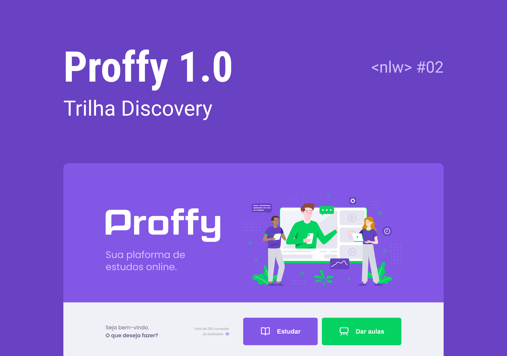

<div align="center">
  <a href="#" alt="Proffy">
    
  </a>
  <h3 align="center">
      🎓 Plataforma que conecta estudantes e professores que oferecem aulas particulares.. ✨
  </h3>
</div>

---

<p align="center">
  <a href="#💻-sobre-projeto">Projeto</a>&nbsp;&nbsp;&nbsp;|&nbsp;&nbsp;&nbsp;
  <a href="#📎-funcionalidades">Funcionalidades</a>&nbsp;&nbsp;&nbsp;|&nbsp;&nbsp;&nbsp;
  <a href="#🎨-layout">Layout</a>&nbsp;&nbsp;&nbsp;|&nbsp;&nbsp;&nbsp;
  <a href="#🚀-como-executar-o-projeto">Executar o projeto</a>&nbsp;&nbsp;&nbsp;|&nbsp;&nbsp;&nbsp;
  <a href="#🛠-tecnologias">Tecnologias</a>&nbsp;&nbsp;&nbsp;|&nbsp;&nbsp;&nbsp;
  <a href="#-author">Author</a>&nbsp;&nbsp;&nbsp;|&nbsp;&nbsp;&nbsp;
</p>

<h2  align="center">


[](./LICENSE)

</h2><br>

</p>

<br>

## 💻 Sobre o projeto

🎓 Proffy é uma plataforma que conecta estudantes e professores que oferecem aulas particulares.

Projeto desenvolvido durante a **NLW - Next Level Week 2ª edição** oferecida pela [Rocketseat](https://www.rocketseat.com.br/).

<br>

## 📎 Funcionalidades

📌 Conexões

- Rota para lista o total de conexões realizadas
- Rota para criar uma nova conexão (quando entrar em contato)
  &nbsp;&nbsp;&nbsp;&nbsp;&nbsp;

📌 Aulas

- Rota para criação de aula
- Listar aulas
  - Filtrar por matéria, dia da semana e horário

<br>

## 🎨 Layout

O layout da aplicação está disponível no [Figma](https://www.figma.com/file/qFw335SSb7sYKfgBtv0Ya2/Proffy-Web?type=design&node-id=81%3A666&mode=design&t=k0sRPHocCKiVZSBS-1):

<p align="center">
  
</p>

<br>

## 🚀 Como executar o projeto

Este projeto é divido em duas partes:

1. Backend (pasta server)
2. Frontend (pasta web)

> 💡 O Frontend precisa que o Backend esteja sendo executado para funcionar.

<br>

#### 🎲 Rodando o Backend (servidor)

```bash

# Clone este repositório
$ git clone git@github.com:nlnadialigia/nlw-proffy.git

# Acesse a pasta do projeto no terminal/cmd
$ cd nlw-proffy

# Vá para a pasta server
$ cd server

# Instale as dependências
$ npm install

# Execute a aplicação em modo de desenvolvimento
$ npm run dev

# O servidor inciará na porta:3333 - acesse http://localhost:3333

```

<br>

#### 🪄 Testando os endpoints

[](https://app.getpostman.com/run-collection/14773197-0050dc4b-5264-46c6-b670-642c2019332e?action=collection%2Ffork&source=rip_markdown&collection-url=entityId%3D14773197-0050dc4b-5264-46c6-b670-642c2019332e%26entityType%3Dcollection%26workspaceId%3D7971a1b7-792d-4b16-8887-ef0f4b4b3c35#?env%5Blocal%5D=W3sia2V5IjoiYmFzZV91cmwiLCJ2YWx1ZSI6Imh0dHA6Ly9sb2NhbGhvc3Q6MzMzMyIsImVuYWJsZWQiOnRydWUsInR5cGUiOiJkZWZhdWx0In1d)

<br>

#### 🧭 Rodando a aplicação web (Frontend)

```bash

# Clone este repositório
$ git git@github.com:nlnadialigia/nlw-proffy.git

# Acesse a pasta do projeto no seu terminal/cmd
$ cd nlw-proffy

# Vá para a pasta da aplicação Front End
$ cd web

# Instale as dependências
$ npm install

# Instalar o react-scripts global
$ npm install -g react-scripts

# Execute a aplicação em modo de desenvolvimento
$ npm run start

# A aplicação será aberta na porta:3000 - acesse http://localhost:3000

```

<br>

## 🛠 Tecnologias

As seguintes ferramentas foram usadas na construção do projeto:

#### **Website** ([React](https://reactjs.org/) + [TypeScript](https://www.typescriptlang.org/))

<!--
- **[React Router Dom](https://github.com/ReactTraining/react-router/tree/master/packages/react-router-dom)**
- **[React Icons](https://react-icons.github.io/react-icons/)**
- **[Axios](https://github.com/axios/axios)**
> Veja o arquivo [package.json](https://github.com/nlnadialigia/nlw-ecoleta/blob/e96458f3f61583994e5d3e695b39d553fe541c3d/web/package.json)
 -->

**Server** ([NodeJS](https://nodejs.org/en/) + [TypeScript](https://www.typescriptlang.org/))

- **[Express](https://expressjs.com/)**
- **[CORS](https://expressjs.com/en/resources/middleware/cors.html)**
- **[KnexJS](http://knexjs.org/)**
- **[SQLite](https://github.com/mapbox/node-sqlite3)**
- **[ts-node](https://github.com/TypeStrong/ts-node)**

> Veja o arquivo [package.json](https://github.com/nlnadialigia/nlw-proffy/blob/30b3b3b45dea32b795f3c166371cb67a2f1c7ea6/server/package.json)

**Utilitários**

- Protótipo: **[Figma](https://www.figma.com/)**
- Documentação API: **[Postman](https://www.postman.com/)**

<br>

## 👩‍💼 Autora


&nbsp;&nbsp;&nbsp;&nbsp;&nbsp;&nbsp;&nbsp;&nbsp;&nbsp;&nbsp;[](https://www.linkedin.com/in/nlnadialigia)&nbsp;&nbsp;
[](mailto:nlnadialigia@gmail.com)&nbsp;&nbsp;
[](https://www.nlnadialigia.com)

---
